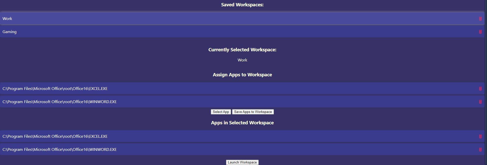

# DeskHub

DeskHub is a productivity and workspace management application built with Electron. It allows users to create and manage workspaces, assign applications to each workspace, and easily launch them. DeskHub aims to enhance productivity by organizing your work environment.

## Features

- **Create Workspaces**: Easily create and manage multiple workspaces.
- **Assign Applications**: Assign up to 6 applications to each workspace.
- **Launch Workspaces**: Quickly launch all assigned applications within a workspace.

## Screenshots

## Installation

- Run the DeskHub.exe

### Prerequisites

- [Node.js](https://nodejs.org/)
- [npm](https://www.npmjs.com/)
